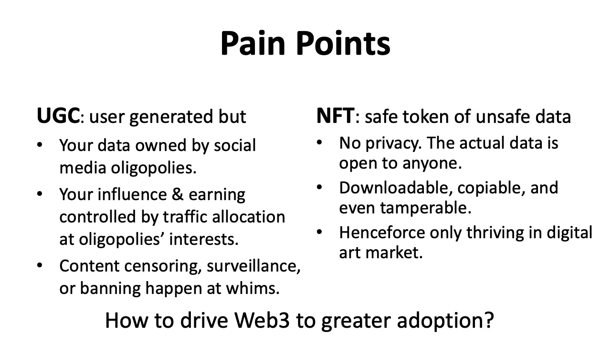

# Babelyx - Smart Market of Soverein Contents

[🎁 Claim your reward and try it now](https://u.babelyx.com/)

What wonders can arise when UGC embraces Web3? **Babelyx** , the Babel Tower for everyone's possibilities, mints any possible UGC to encrypted Sovereign Assets that autonomously circulate in the Smart Market, increasing every participant's perpetual rewards. Step into **Babelyx** to monetize your contents and earn passive income!

### What is Babelyx?

**Babelyx** is the Babel Tower for everyone's possibilities.

In the Book of Genesis from the Bible, God created the world and humanity, who then spread across the Earth. One day, ancient humans decided to build **The Tower of Babel** . At that time, everyone spoke the same language and shared a common goal, successfully constructing a towering structure. When the tower was about to reach the heavens, God became fearful and confused their language, causing people to be unable to understand each other and to fight among themselves. Consequently, the tower was never completed and eventually crumbled into ruins.

Argentinian writer Julio Cortázar proposed an imaginary concept in his famous 1941 novella, **The Library of Babel** . This library is a simple yet infinite library containing all possible combinations of letters. In this library, standing at any position and looking around, one would see endless bookshelves composed of countless hexagonal bookcases. Each bookcase contains books where any two adjacent books differ by only one letter. Despite such minuscule differences, if you walk far enough along the bookshelves and take enough turns, you will inevitably find any book you desire. This boundless library contains all languages, all subjects, and all meanings, encompassing the past, present, and all possible futures, waiting to be discovered.

In Eastern Buddhism, there's also the concept of **Three Thousand Great Thousand Worlds** , depicting a macro-to-microcosmic structure of the universe. These worlds consist of countless great thousand worlds (Mahāsaha-loka), each containing numerous middle thousand worlds (Madhya-loka), within which exist the six realms of reincarnation. Each middle thousand world houses numerous small thousand worlds (Saha-loka), each with its own heavens, earth, sentient beings, and various forms of existence, possessing unique life, landscapes, and rules. This concept illustrates the vastness and diversity of the multi-universe, where countless worlds, large and small, exist, each with its distinct characteristics and forms of existence, representing the boundless sentient beings in Buddhism.

### Painpoints Today

We all know that what you post on the internet does not truly belong to you, but rather to social media oligopolies like Facebook, TikTok, X, and other centralized platforms. Your influence and earning are entirely reliant on the traffic allocation at their interests. Content censoring, surveillance, blockade, or outright banning can happen at the whim of their operators.

This is why Web3 emerged. Especially, since its rise in 2021, NFT technology has garnered significant attention, transforming digital content into unique assets and forging direct, intimate connections between creators, fans, sponsors, and investors. (See [NFTs: Empowering Creators in the Digital World](https://learn.metamask.io/lessons/nfts-and-creators))

However, **NFTs are merely "safe token of unsafe data"**. While the NFTs themselves are unreplicable and tamper-proof through blockchain technology, the actual data behind NFT is still as vulnerable as traditional internet (Web2) content, lacking privacy protection and being accessible, copyable and even tamperable by anyone. This vulnerability limits the application scenarios of NFT technology. Up until now, NFT is primarily only thriving in the digital art market.

To resolve these pain points for pushing Web3 to greater adoption, we designed Babelyx.

### What Does Babelyx?

Babelyx mints any possible UGC into **Sovereign Assets** that autonomously circulate in the **Smart Market** to perpetually increase every participant's **Passive Income**, unleashing infinite possibilities for everyone.

As a user, by creating any content you get an encrypted asset and an autonomous store, bringing you continuous revenue forever.

This is made possible by our patented **BLX** technology that seamlessly integrates data security of IPFS, digital ownership of NFTs, and smart contracts of Ethereum, along with powerful AIGC technologies, providing you with an unprecedented experience, rights and rewards.

Babelyx features:

##### 1. Sovereign Asset

User-generated content is minted to Sovereign Content Assets by following steps:

1. At first the actual content is stored in the decentralized content-addressing system IPFS;
2. Then, hash addresses of the content and their stakeholders are encrypted and stored in the "Sovereign Content Certificate" in IPFS;
3. Finally, the certificate pointing to the encrypted content is minted into a "Sovereign Content Token" on a blockchain.

Through these steps, NFT is upgraded to These Soverein Content Tokens can be viewed as Safe NFTs. While the certificate and token are public, the actual content is fundamentally prevented from unauthorized access, copying, distribution, and tampering. For instance, others must pay a decryption fee to the content owner, to be able to access the actual content through a decentralized mechanism.

Therefore, the sovereign asset not only ensure your ownership, but also goes further to unbreakably safeguard your data privacy and security by means of mathematical principles!

##### 2. Smart Market

Sovereign Assets circulate and appreciate perpetually in the Smart Market, powered by Role Pacts stored in the sovereign content certificates. Role pacts are smart contracts defining rights and benefits of different market roles. Through Role Pacts, the underlying asset can be traded autonomously among various participant roles. For example:

- **Creator Pact** is an intrinsic part of the sovereign content asset. Once some piece of content is minted, the content creator becomes an indelible, unalterable and permanent property of the sovereign content. In all subsequent appreciation of this asset, the original creator will automatically receive corresponding returns according to the Creator Pact.
- **Visitor Pact** defines a decryption fee for visitors. Other user must pay the decryption fee to be able to visit the original content. Anyone else cannot decrypt the asset to see, copy or download the actual content. If the creator does't set a decription fee, it's default to 0, henceforce the content is open to public just like in a traditional UGC platform.
- **Holder Pact** defines a purchase fee for buyers. A user who pays the purchase fee becomes a "holder" of a certain share of the asset. Holding rights apply to limited-supply shareable assets such as book copies, movie tickets, membership statuses, restaurant seats, rental time slots, etc. Users can transfer their limited slots at new prices to other holders, promoting sharing, circulation, and appreciation.
- **Owner Pact** keeps track of the current owner of the asset and the buyout price for full ownership. Other users can acquire the asset by purchasing it outright, becoming the new owner. Each asset can only belong to one owner at any given time. The access, holding, rental, and other revenue from the asset are mainly enjoyed by its current owner.
- Additional pacts: Beyond these roles, assets can have more detailed or extended roles such as agents, operators, renters, and more, just like in the real-world.

Thus, Role Pacts turn user content to a perpetual self-running store. Without stakeholders' intervention, the asset can circulate and appreciate among different market roles, providing long-term stable income for stakeholders and maintaining high enthusiasm for various user types.

##### 3. AI-Assisted Creation

Have you ever been stuck in a creative rut, unable to find inspiration despite racking your brains? Don't worry, our AI assistant is always on standby, providing a wisdom-filled inspiration booster. With AI's creative assistance, you will continuously spark new ideas, connecting seemingly unrelated dots into the most brilliant pictures, bringing words to life on paper and making videos more vivid and moving.

### How to play with Babelyx?

[Babelyx is available for you as Web, iOS, Android apps and more](https://links.babelyx.com)!

Building on our technology and products, we collaborate with partners across various industries and sectors to expand a rich array of application scenarios and business models. We can enhance traditional internet applications or create entirely new decentralized applications.

Babelyx supports everyone in constructing a universe of infinite possibilities! Let data return to individuals, free from the control of monopolistic platforms. Break through the platform-centric traffic economy of the traditional internet and usher in a decentralized economy centered on individual rights.

[🎁 Claim your reward and try it now](https://u.babelyx.com/)

---

**[🔙️ Contents Table](./home.md)**
